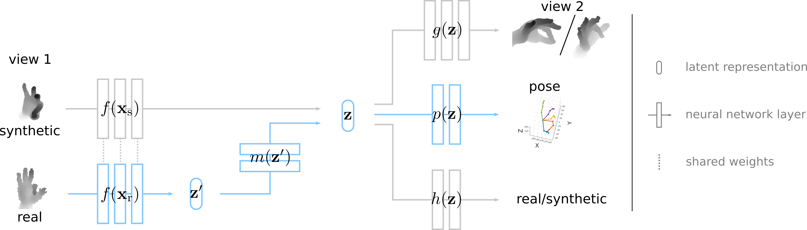

# MURAUER: Mapping Unlabeled Real Data for Label AUstERity
This repository contains the code for the semi-supervised method introduced in:  

[**MURAUER: Mapping Unlabeled Real Data for Label AUstERity**](https://arxiv.org/abs/1811.09497)  
Georg Poier, Michael Opitz, David Schinagl and Horst Bischof.  
In *Proc. WACV*, 2019. ([Project Page](https://poier.github.io/murauer/)).

---

  
We learn to map from the features of real data to the features of synthetic data. 
The mapping is mainly learned from a large amount of synthetic as well as _unlabeled_ real data. 
We exploit unlabeled data using two auxiliary objectives, 
which enforce that (i) the mapped representation is pose specific and 
(ii) at the same time, the distributions of real and synthetic data are aligned.
While the distributions are aligned using an adversarial term, 
pose specificity is enforced by building on 
[our previous work](https://poier.github.io/PreView/). 
By exploiting unlabeled data in this way 
we can significantly improve the results for hand pose estimation and 
outperform many recent approaches already with about 1% of the labeled real data they use.

## Usage
1. Download dataset
2. Adapt paths in configuration to point to the dataset
3. Run code

### Download dataset
We provide a data-loader the 
NYU dataset [[1]](https://cims.nyu.edu/~tompson/NYU_Hand_Pose_Dataset.htm).

### Adapt configuration 
You need to change the respective paths (to the location of the dataset) 
in `config/config_data_nyu.py`.

### Run code

    python main_run.py

By default, this will first pre-train the model using only synthetic data, then
train the model using all data, and finally test it 
(see below for using pre-trained models).
The code will log the training and validation error using crayon 
(see [https://github.com/torrvision/crayon](https://github.com/torrvision/crayon)),
and output final results in the `results` folder.
To change further settings you can adapt the respective configuration files 
in the `config` folder or via the command-line 
(see `python main_run.py --help` for details). 
The default settings should reproduce the results from the paper.

#### Use pre-trained model
We provide a model pre-trained only on synthetic data (to skip 
the pre-training) as well as fully trained models (using different 
numbers of labeled real samples).

##### Use model pre-trained with synthetic data
Download the model (filename: `model_synth_only.mdl_pretrain`) from 
[our server](https://files.icg.tugraz.at/d/0e6ccba6689040349f21/).
To use the default configuration, place the model in `results/pretrained_models/synthetic_only`:
```
mkdir -p results/pretrained_models
wget -O results/pretrained_models/model_synth_only.mdl_pretrain https://files.icg.tugraz.at/f/e455628c1d8a44289a03/?dl=1
```
If you placed the model at a different location you need to change 
`args.pretrained_model_filepath` in `config/config.py` accordingly. You can then start the training from the pre-trained model by calling
```
cd source
python main_run.py --do-load-pretrained-model
```

##### Use fully trained models
Download the respective model from 
[our server](https://files.icg.tugraz.at/d/0e6ccba6689040349f21/).
We (will soon) provide models trained with different numbers of labeled real samples.
E.g., to use the model trained with all labeled real samples from the NYU dataset:
```
mkdir -p results/pretrained_models
wget -O results/pretrained_models/model_full_n73k.mdl https://files.icg.tugraz.at/f/71cd78dda19e4c4d8f67/?dl=1
```
You can then generate results using this one by:
```
cd source
python main_run.py --model-filepath ../results/pretrained_models/model_full_n73k.mdl --no-train
```

#### Training/Testing speed
In our case, data loading is the bottleneck. 
Hence, it's very beneficial if the data is stored on a disk with fast access times (e.g., SSD).
Several workers are concurrently loading (and pre-processing) data samples.
The number of workers can be changed by adjusting `args.num_loader_workers` 
in `config/config.py`.

Additionally, we use binary files to speed up training/testing. 
The binary files can be loaded faster, which will usually yield a significant 
speed up for training and testing. 

To make use of the binary files, you need to set `args_data.use_pickled_cache = True` 
in `config/config_data_nyu.py`. Then, the binary files are used instead of the original images. 
If a binary file for an image does not exist already, it is automatically 
written the first time the image is loaded. 
Hence, the process will be slower the first time training/testing is done with 
`args_data.use_pickled_cache = True`.

To ensure that all binary files will be properly written we recommend to 
generate all binary files before training/testing.
To do so, call:
```
python main_generate_data_cache.py
```
Note, this is not always necessary but prevents possible issues during 
creation of the binary files.

## Requirements
We used Python 2.7.
To run the code you can, e.g., install the following requirements:

 * [PyTorch](http://pytorch.org/) (tested with version 0.4.1; torch, torchvision)
 * [OpenCV](https://opencv.org/) (tested with version 2.4.9)
 * matplotlib
 * enum34
 * scipy
 * [pycrayon](https://github.com/torrvision/crayon)

### pycrayon
By default the code sends the data to port 8889 of "localhost". 
That is, you could start the server exactly as in the usage example in the 
[crayon README](https://github.com/torrvision/crayon/blob/master/README.md), 
i.e., by calling
```
docker run -d -p 8888:8888 -p 8889:8889 --name crayon alband/crayon
```
See [https://github.com/torrvision/crayon](https://github.com/torrvision/crayon) 
for details.


## Citation
If you can make use of this work, please cite:

MURAUER: Mapping Unlabeled Real Data for Label AUstERity.  
Georg Poier, Michael Opitz, David Schinagl and Horst Bischof.  
In *Proc. WACV*, 2019.

Bibtex:
```
@inproceedings{Poier2019wacv_murauer,  
  author = {Georg Poier and Michael Opitz and David Schinagl and Horst Bischof},  
  title = {{MURAUER}: Mapping Unlabeled Real Data for Label AUstERity},  
  booktitle = {{Proc. IEEE Winter Conf. on Applications of Computer Vision (WACV)}},  
  year = {2019}
}
```

## References
\[1] [https://cims.nyu.edu/~tompson/NYU\_Hand\_Pose\_Dataset.htm](https://cims.nyu.edu/~tompson/NYU_Hand_Pose_Dataset.htm)

